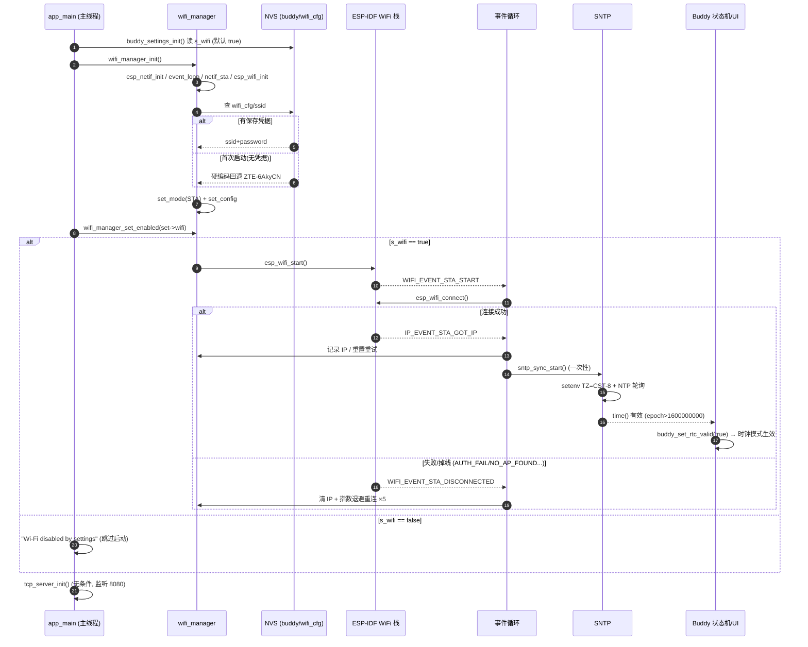

# WiFi 管理模块：初始化加载逻辑与时序

## 概述

WiFi 管理模块 (`main/wifi_manager.c`) 负责 ESP32-S3 的 STA 模式连接，包含驱动初始化、凭据加载（NVS 优先，硬编码回退）、自动重连（指数退避）、IP 获取事件处理，并在联网成功后触发 SNTP 时间同步。与 TCP Server（端口 8080）解耦，TCP 监听不依赖 WiFi 连接状态。

## 相关文件

| 文件 | 职责 |
|------|------|
| `main/wifi_manager.c/h` | WiFi 初始化、启停、凭据管理、事件处理 |
| `main/comm/sntp_sync.c` | SNTP 时间同步（GOT_IP 后触发，一次性） |
| `main/main.c` (步骤 8.5) | 启动入口：init → set_enabled → tcp_server_init |
| `main/comm/uart_comm.c` | 运行时 `wifi <ssid> <password>` 命令改配置 |
| `main/ui/buddy/buddy_ui.c` | 设置菜单 Wi-Fi 开关 |

## 初始化调用链

`app_main()` 初始化步骤 8.5：

```c
wifi_manager_init();                    // ① 配置注册，幂等
if (set->wifi) {
    wifi_manager_set_enabled(true);     // ② 真正启动，受 NVS 设置 s_wifi 控制
} else {
    ESP_LOGI(TAG, "Wi-Fi disabled by settings");
}
tcp_server_init();                      // ③ 无条件启动（不依赖 WiFi 状态）
```

### `wifi_manager_init()` 内部流程（只执行一次）

```
esp_netif_init()                     → 网络接口层
esp_event_loop_create_default()      → 默认事件循环（仅此处创建）
esp_netif_create_default_wifi_sta()  → STA 网络接口
esp_wifi_init(WIFI_INIT_CONFIG_DEFAULT) → 驱动初始化（配置来自 sdkconfig）
注册事件处理器:
  ├─ WIFI_EVENT / ESP_EVENT_ANY_ID       → wifi_event_handler
  └─ IP_EVENT / IP_EVENT_STA_GOT_IP      → wifi_event_handler

读取凭据（二选一）:
  ├─ NVS "wifi_cfg" 命名空间有 ssid → 用保存的 ssid+password
  └─ 无 → 硬编码回退 "ZTE-6AkyCN" / "07200329"

esp_wifi_set_mode(WIFI_MODE_STA)     → 仅 STA 模式
esp_wifi_set_config(WIFI_IF_STA, ...)
※ 此处不 esp_wifi_start()，由 set_enabled 控制
```

### `wifi_manager_set_enabled(true)` 及事件驱动链

```
esp_wifi_start()
   └─▶ 事件 WIFI_EVENT_STA_START ──▶ esp_wifi_connect()   （自动连接）
            │
            ├─▶ WIFI_EVENT_STA_DISCONNECTED（失败/掉线）
            │      ├─ 清空 s_current_ip
            │      └─ 指数退避重连: 1s→2s→4s→8s→8s，最多 5 次
            │             └─ 5 次后放弃（仅日志）
            │
            └─▶ IP_EVENT_STA_GOT_IP（成功）
                   ├─ 记录 IP、重置重试计数
                   └─ sntp_sync_start()   （一次性，s_sntp_started 保护）
                          ├─ setenv("TZ","CST-8") / tzset()
                          ├─ POLL 模式: pool.ntp.org + ntp.aliyun.com
                          └─ 同步完成 → time() > 1600000000
                                 └─▶ main.c update_clock():
                                       sntp_sync_is_synced() && !buddy_rtc_valid()
                                       → buddy_set_rtc_valid(true) → 时钟模式生效
```

## 时序图



## 影响 WiFi 模块加载的因素

### 1. NVS 设置 `s_wifi`（最直接）

`buddy_settings_init()` 从 `buddy` 命名空间读 `s_wifi`，为 false 时 `esp_wifi_start()` 完全不被调用，只保留 `wifi_manager_init()` 注册的配置。

### 2. NVS 凭据存在性

`wifi_cfg/ssid` 是否存在决定用"保存凭据"还是"硬编码回退"。硬编码凭据是编译期常量，首次启动/刷机清 NVS 后生效。

### 3. NVS 分区状态

`nvs_flash_init()` 返回 `NO_FREE_PAGES`/`NEW_VERSION_FOUND` 时会**整区擦除重建** → 所有设置和凭据丢失 → `s_wifi` 回到默认 true、凭据回退硬编码。

### 4. 任务创建顺序（内存因素）

`main.c` 注释明确：`lvgl_handler`/`uart_rx`/`cmd_proc` 三个任务必须在 WiFi 前创建，否则 WiFi 占用内部 RAM 后任务创建可能失败。若 `xTaskCreate` 返回非 `pdPASS` 只打日志不中止。

### 5. 连接失败类型

- `AUTH_FAIL`（密码错）、`NO_AP_FOUND`（热点不存在）等会走指数退避重连（1/2/4/8/8s），**5 次后放弃**，不阻塞主流程，TCP Server 照常运行
- 运行时掉线走同一重连路径

### 6. 事件循环唯一性

`esp_event_loop_create_default()` 只在 `wifi_manager_init()` 里调用一次；`wifi_manager_init()` 本身幂等（`s_wifi_initialized` 保护，且 `ESP_ERROR_CHECK` 失败即 abort，不存在半初始化态）。

### 7. SNTP 触发依赖 GOT_IP

时间同步只在获得 IP 后启动，且 `s_sntp_started` 一次性保护（WiFi 重连不会重复初始化）。时钟模式（`clocking`）还需 `claude->connected`（曾与 opencode 配对）才启用纯时钟动画。

### 8. TCP Server 与 WiFi 解耦

`tcp_server_init()` 无条件创建，绑定 `INADDR_ANY` 监听 8080。**WiFi 关闭时 TCP 回传路径失效**——`comm_console_write_len()` 把设备→主机命令同时发到 TCP 客户端，无连接时直接丢弃，审批回复等会丢失（`uart_comm.c` 注释已注明此场景依赖 TCP）。

### 9. sdkconfig 编译配置

`esp_wifi_init(WIFI_INIT_CONFIG_DEFAULT)` 的静态配置（频段、日志、内存类型等）来自构建时 `sdkconfig`，改动需重新编译烧录。

## 运行时两条改配置路径

| 路径 | 触发 | 行为 |
|------|------|------|
| 设置菜单 `Wi-Fi` 开关 | `execute_settings_action(BUDDY_SET_WIFI)` | `buddy_settings_save()` + `wifi_manager_set_enabled(set->wifi)` 立即启停 |
| UART 命令 `wifi <ssid> <pass>` | `comm_parse_cmd()` 前缀匹配 | 存 NVS `wifi_cfg` + `esp_wifi_set_config()` + disconnect 触发重连 |

## 关键状态变量

| 变量 | 作用 |
|------|------|
| `s_wifi_initialized` | `wifi_manager_init()` 幂等保护 |
| `s_wifi_enabled` | 当前启停状态（`esp_wifi_start/stop` 配对） |
| `s_retry_count` | 重连计数，GOT_IP 后清零 |
| `s_current_ip` | 当前 IP 字符串，断开时清空 |
| `s_sntp_started` | SNTP 一次性保护 |
| `set->wifi` (NVS `s_wifi`) | 用户设置，控制启动开关 |
